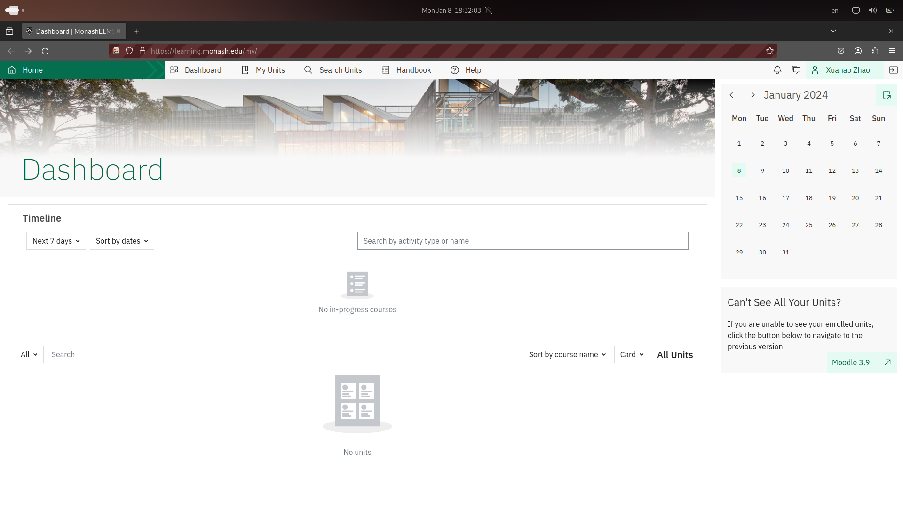

Better Monash
===

A Manifest V3 plugin for customising Monash webpages. 

### Browser Support

Currently only tested on Firefox. No Chrome / Chromium based browser support in plan at the moment.

### Webpage Support

Currently developing for Moodle 4.1 (The new Moodle starting from 2024).

Will add support for Moodle 3.9 and WES after Moodle 4.1.

### Developing and Debugging

##### Debug with `web-ext`

The recommended method.

To setup the environment:

1. Install `web-ext` (See [Getting started with web-ext](https://extensionworkshop.com/documentation/develop/getting-started-with-web-ext/) for help)
2. Clone this project
3. `cd` into the project folder.
4. Run `npm install` or any other preferred package manager.

To start debugging:

1. Run `npm run build` to build the plugin. The output will be in the dist directory.
2. Have another terminal `cd`'ed into the dist directory. Keep that terminal open.
3. Run `web-ext run` in the dist directory.
4. In the temporary browser, go to extension settings and enable permissions for the extension.
5. Go to Moodle webpage and start debugging.
6. When updating files:
   1. Make some changes to files in src or static, then run `npm run build` again to update.
   2. Reload opened webpages.

##### Debug on Firefox without `web-ext`

1. Setup the environment as mentioned above without installing `web-ext`.
2. Build the project to dist directory.
3. Refer to [this guide](https://developer.mozilla.org/en-US/docs/Mozilla/Add-ons/WebExtensions/Your_first_WebExtension#testing) to test the plugin on your firefox browser.

### Contributing

Create pull requests but im not sure if I can review them frequently.